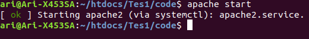

# Search-Engine-sederhana-python
## Langkah - langkah untuk menjalankannya

1. Pastikan sudah terinstall lamp-server dan semua package yang akan kita gunakan
2. Jalankan Crawl.py untuk mengcrawling sekaligus mengambil atau menyimpan link/url

`$ python3 Crawl.py`

3. Kemudian jalankan program Clean.py untuk membersihkan isi dari url yang sudah kita crawl

`$ python3 Clean.py`

4. Kemudian jalankan program Score.py untuk menyimpan score dari tiap kata

`$ python3 Score.py`

5. Kemudian aktifkan apache di terminal

`$ apache start`

6. Buka browser, ketik `localhost/[nama folder]`
Maka akan tampil seperti di bawah ini

7. Jika ingin mengubah tampilan, silahkan ubah di bagian index.php dan di folder assets
